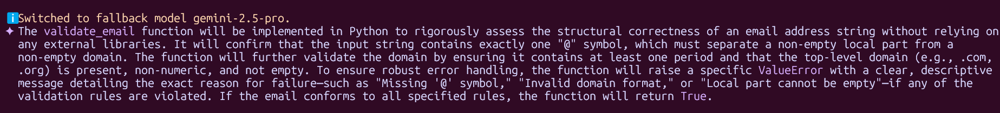

# Solution 

## **Part A**

### 1. Nine Pillars Undrstanding
 
**Ans 1**  
 Using AI coding agents like claude code ir gemini cli boosts my productivity as a dev, they can execute commands and write code by themselves in the IDE, although with time you the developer looses context od the codebase if you don't know what changes your agent made, so make sure to have strict control over your agent and on your codebase, you should know what's happening in your codebase.

Use AI coding agents but more importantly don't shut your brain off!


**Ans 2**  
There as an era where only specialists were valued (they are still more valued in my eye then an average generalist) but now time has changed you don't need expertise in a domain so much that you can't focus on other domains you need to have a solid command on one domain and explore others as well so you work in both utilizing AI.

Before: T Shaped, single domian expertise, know a bit of other domains.

Now: Profound and Solid in multiple domains and have know how of others means can work on them as well.

### 2. Vibe Coding vs Specification-Driven Development

**Ans 1**  
Vibde coding is best for very very quick prototyping but when building real, scalable apps it just start vometing garbage code with no proper implementation and zero docs and tests.  

**Ans 2**  
SPDD the newest coding shift that solves this problem now you are not generating code from AI, but you are writing detailed specifications, setting frameworks or constitutions means setting up core rules that AI must follow, so the appraoch shifted this is even cleaner then traditional programming and 20x faster.

You: Write Specs  
AI Agent: Handle Implementation

### 2. Architecture Thinking  

**Ans 1**  
Now you won't be thinking about the code implementation you will only be thinking about the flow, and architecture, AI Agents will handle the rest.  

**Ans 2**  
Now the time has gone where you needed to implement every function by yourself now think of your system as layers and make the AI agent build those layers for you one by one.     


## **Part B**

### Prompt:
```
Write down a **one paragraph** specifications for an email validation function, that will be implemented using Python, and will not use any external library.   
- email should have @
- email should end with a valid domain, e.g: .com, .pk, .org etc                                  
- handle errors extesivly and keep proper error handlings 
```

### Response:



## **Part C**

1. B  
2. B
3. B
4. B
5. C


## **Reflection**

Learned a new term M shaped developer, seems cool other than that understood the 3rd and 4th wave of AI tools, the future looks promising :)