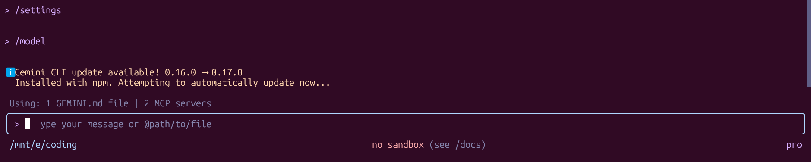

# Solution

## Part A

### Answer 1

A context window of 1 Million token is introduced which is massive, gemini 2.5 had ---- also a deep think feature is launched for complex reasoning and it is fully multimodal, means text, audio, video everything is supported.  

### Answer 2

Alongside gemini 3 Google also launched Antigravity a revolutionary product which has agent, ide, and brower all at once.  
This is the only tool you need to go from idea to product.
Also gemini 3 excels at vibe coding the major focus of this model was coding.  

### Answer 3

From day one it is built for multimodal tasks.
It can gather info form, text, audio and even video.

### Answer 4 
- Antigravity 
- Gemini CLI

## Part B

### SS Of Gemini 3 in Gemini CLI:
