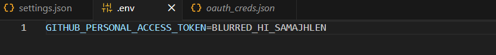
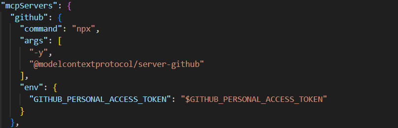
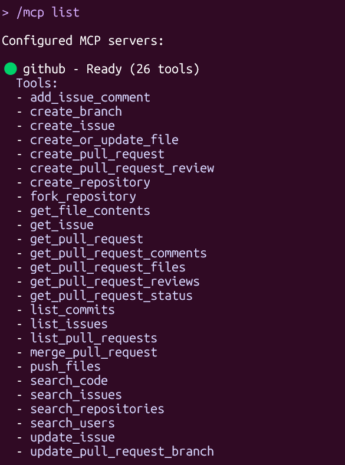
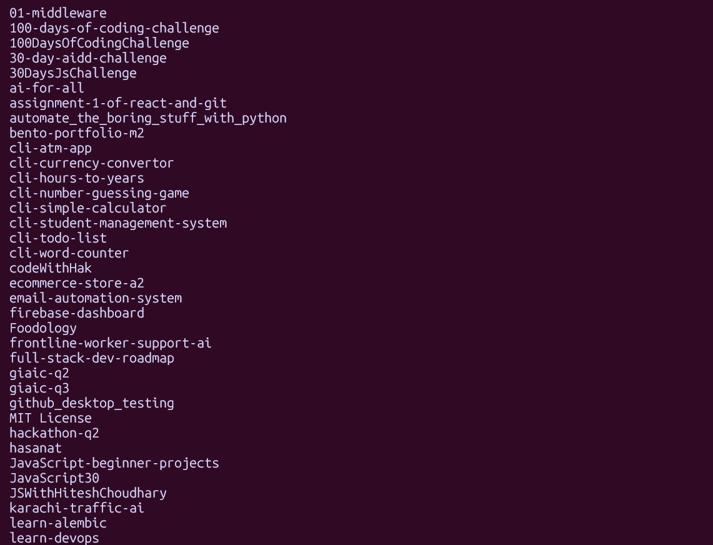

# Solution

### 1. Environment Configuration (.env file)

*Environment file with access token (sensitive data blurred for security)*

---

### 2. Settings Configuration (settings.json)

*Github MCP server configuration in settings.json*

---

### 3. MCP Server List

*Output of `/mcp list` command showing configured servers*

---

### 4. GitHub Repository List

*List of accessible GitHub repositories*

