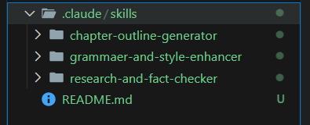

# Overview of Available Skills

This repository includes a set of specialized skills designed to enhance an AI agent’s capabilities in storytelling, research, and writing refinement. Each skill targets a specific function and can be combined to create flexible, extensible workflows.

## Chapter Outline Generator
A narrative-focused skill that creates detailed, structured chapter outlines for books. It defines key events, character progression, themes, and transitions while following a clear overarching story arc.

## Research & Fact-Checking Tool
A verification-oriented skill that validates claims, clarifies complex information, and summarizes reliable findings. It emphasizes accuracy, source credibility, and consistency in presenting facts.

## Grammar & Style Enhancer
A writing improvement skill that corrects grammar, enhances readability, refines tone, and strengthens overall clarity without changing the intended message.

---

## Screenshot of `.claude` Directory  

