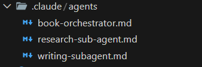

# Overview of Book Writing Sub-Agents

This folder contains specialized sub-agents designed to work together to streamline the book creation workflow. Each agent has a focused role and collaborates with others under the guidance of the Main Orchestrator to ensure high-quality, structured, and accurate outputs.

## Current Sub-Agents

### book-orchestrator.md
The central orchestrator that manages the entire book creation process.  
Responsibilities:
- Coordinating Research, Writing, and Editing Sub-Agents
- Tracking progress and deadlines
- Integrating outputs into a cohesive final product
- Handling workflow issues and escalation to the user

### research-sub-agent.md
The analytical engine for gathering and verifying information.  
Responsibilities:
- Fact-checking and cross-verifying claims
- Summarizing research findings
- Providing reliable data to Writing and Editing Sub-Agents
- Highlighting uncertainties or conflicting information

### writing-sub-agent.md
The creative drafting engine for content generation.  
Responsibilities:
- Producing draft text based on chapter outlines and research
- Maintaining narrative flow, style, and coherence
- Flagging unclear points for review
- Delivering drafts ready for editing

---

## Workflow Overview

1. **Project Initiation** – The `book-orchestrator` collects requirements and defines chapter outlines.  
2. **Research Phase** – The `research-sub-agent` gathers and validates information.  
3. **Drafting Phase** – The `writing-sub-agent` generates content based on outlines and research inputs.  
4. **Editing & Refinement** – (Future) The `editing-sub-agent` will refine grammar, style, and consistency.  
5. **Integration & Quality Check** – The orchestrator ensures all outputs are cohesive, accurate, and aligned with the user’s vision.

---

## Future Enhancements

- Add an **Editing Sub-Agent** for grammar and style improvements.  
- Expand research capabilities with specialized topic agents.  
- Introduce automated progress reporting and milestone tracking within the orchestrator.

---

## Screenshot of `.claude` Directory

